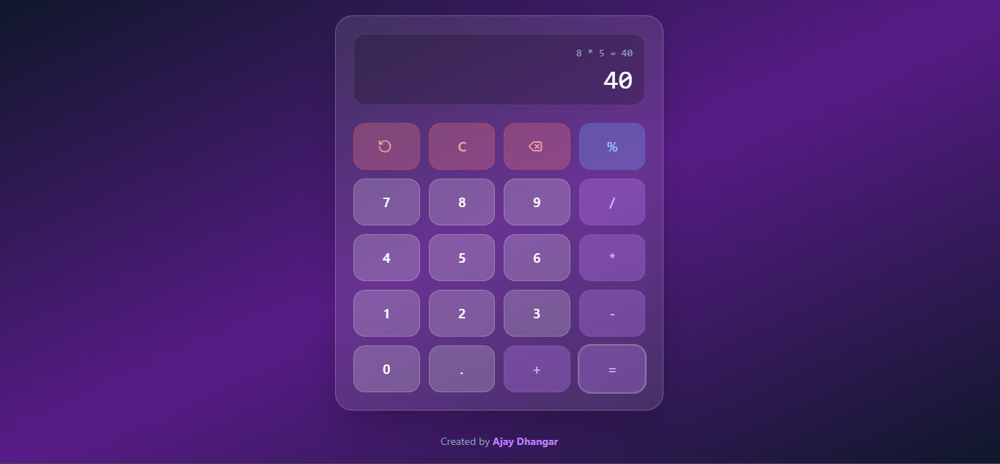

# 📱 Beautiful Calculator Web App

A modern, stylish, and functional calculator built with **React**, **TypeScript**, and **Tailwind CSS**. It features basic arithmetic operations, percentage calculation, undo, and delete — all wrapped in a stunning **glassmorphism UI**.

---

## 🌐 Live Demo

🔗 View Demo [(http://localhost:5173)](http://localhost:5173)
🧑‍💻 Created by [Ajay Dhangar](https://github.com/ajay-dhangar)

---

### 📸 Preview



> 💡 This is a real-time responsive calculator with expression display, interactive button feedback, and undo feature.

---

### ✨ Features

* 🧮 **Arithmetic Operations** (`+`, `-`, `*`, `/`)
* 💯 **Percentage Calculation**
* 🔙 **Undo** last input or operation (`↺`)
* ⌫ **Delete** last digit
* 🧼 **Clear All** inputs
* 🎨 **Modern UI with Glassmorphism** design
* ⚛️ Built with **React + TypeScript**
* 📱 **Responsive** on all devices

---

### 🚀 Tech Stack

| Tech         | Role                        |
| ------------ | --------------------------- |
| React        | Frontend UI Framework       |
| TypeScript   | Typed JavaScript            |
| Tailwind CSS | Utility-first CSS Framework |
| Lucide React | Icons (Undo, Delete, etc.)  |
| Vite         | Lightning-fast Dev Server   |

---

### 📂 Project Structure

```
project-10/
├── src/
│   ├── components/
│   │   ├── Calculator.tsx
│   │   ├── Display.tsx
│   │   └── Button.tsx
│   ├── App.tsx
│   └── main.tsx
├── public/
│   └── favicon.svg
├── index.html
├── tailwind.config.js
├── vite.config.ts
└── README.md
```

---

### 🧑‍💻 Getting Started

To run this project locally:

```bash
# Clone the repository
git clone https://github.com/ajay-dhangar/calculator.git

# Navigate into the directory
cd calculator

# Install dependencies
npm install

# Start the development server
npm run dev
```

---

### 📦 Scripts

| Command           | Description                  |
| ----------------- | ---------------------------- |
| `npm run dev`     | Start the development server |
| `npm run build`   | Build for production         |
| `npm run preview` | Preview production build     |

---

### 🔗 Topics (GitHub Tags)

```
react, typescript, tailwindcss, calculator, undo-feature, lucide-icons, webapp, glassmorphism, ui-design
```

---

### 📃 License

This project is licensed under the [MIT License](LICENSE).

---

### 🙏 Acknowledgements

* [React](https://reactjs.org/)
* [Tailwind CSS](https://tailwindcss.com/)
* [Lucide Icons](https://lucide.dev/)
* [Vite](https://vitejs.dev/)